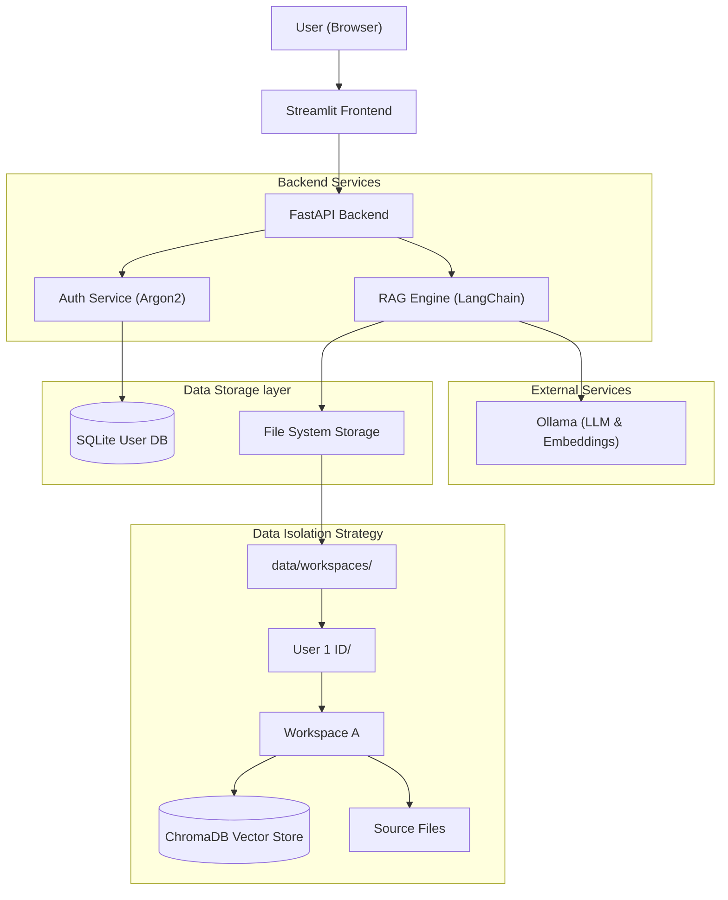

# LangChain RAG Application with Ollama (Multi-User & Multi-Workspace)

This is a local Retrieval-Augmented Generation (RAG) application built with Python, FastAPI, Streamlit, LangChain, and Ollama. It features **true multi-user isolation**, ensuring that each user has their own private set of workspaces and documents.

## Architecture



## Features

- **True Multi-User Isolation**: 
  - Complete data separation between users.
  - Files and vector databases are stored in user-specific directories `data/workspaces/{user_id}/`.
  - One user cannot access or see another user's workspaces.
- **Secure Authentication**: 
  - Register and Login system backed by SQLite and Argon2 password hashing.
  - Session-based access control.
- **Multi-Workspace Support**: Users can create multiple distinct project workspaces (e.g., "Finance", "Legal", "Personal").
- **Multi-Format Document Ingestion**: 
  - PDF (`.pdf`)
  - Word (`.docx`, `.doc`)
  - Excel (`.xlsx`, `.xls`)
  - CSV (`.csv`)
  - Text (`.txt`)
- **Advanced RAG Pipeline**:
  - Local Embeddings via Ollama (default: `nomic-embed-text`).
  - Vector Store: ChromaDB (persistent per workspace).
  - LLM: Llama 3 (configurable).
- **Feedback System**: Built-in 5-star rating system for RAG responses, with analytics dashboard tracking performance per user.

## Prerequisites

1. **Python 3.9+**
2. **Ollama**: You must have Ollama installed and running.
   - Install Ollama from [ollama.com](https://ollama.com).
   - Pull the necessary models:
     ```bash
     ollama pull llama3
     ollama pull nomic-embed-text
     ```

## Project Structure

```
langchain-rag-ollama/
├── backend/
│   ├── main.py          # FastAPI | API Routes, Auth & Session Management
│   └── rag.py           # RAG Core | LangChain, ChromaDB & directory isolation logic
├── frontend/
│   └── app.py           # Streamlit UI | Login, Chat Interface & File Upload
├── data/
│   ├── users.db         # SQLite database for user credentials
│   └── workspaces/      # Root directory for all user data
│       ├── {user_id}/   # Isolated directory for specific user
│       │   ├── {workspace_name}/
│       │   │   ├── chroma_db/  # Vector store for this workspace
│       │   │   └── source_files/
│       └── ...
├── requirements.txt
└── README.md
```

## Setup & Installation

1. **Create Virtual Environment** (Recommended)
   ```bash
   python -m venv venv
   source venv/bin/activate  # On Windows: venv\Scripts\activate
   ```

2. **Install Dependencies**
   ```bash
   pip install -r requirements.txt
   ```

## Running the Application

You need to run both the backend (FastAPI) and the frontend (Streamlit).

### 1. Start the Backend API

Open a terminal and run:

```bash
uvicorn backend.main:app --host 0.0.0.0 --port 8000 --reload
```
The API is available at `http://localhost:8000`. Documentation: `http://localhost:8000/docs`.

### 2. Start the Frontend UI

Open a **new** terminal (keep the backend running) and run:

```bash
streamlit run frontend/app.py
```
The UI will open in your browser at `http://localhost:8501`.

## Usage Workflow

1. **Authentication**: 
   - On first launch, you will see a login/registration screen.
   - **Register** a new account with your email, name, and password.
   - **Login** with your credentials to access the application.
2. **Create Workspace**: In the sidebar, expand "Create New Workspace", enter a name (e.g., "Finance"), and click Create.
3. **Select Workspace**: Choose your created workspace from the dropdown. 
4. **Upload Documents**:
   - Upload one or multiple documents (`.pdf`, `.txt`, `.docx`, `.xlsx`, `.csv`).
   - The sidebar displays a list of currently uploaded files and their chunk counts.
   - Adjust chunk size/overlap if needed.
   - Click "Process Documents".
5. **Chat**:
   - Ask questions in the main chat interface. 
   - Generative answers will be based ONLY on documents in the **selected workspace**.
   - Rate the quality of the answer using the star rating system.
6. **View Feedback**:
   - Switch to the "Feedback Analytics" tab to view metrics and a table of all collected feedback.
7. **Switch Context**: Simply select a different workspace in the sidebar to switch context immediately.
8. **Logout**: Use the "Logout" button in the sidebar to end your session.

## Troubleshooting

- **No Models Found**: Ensure Ollama is running (`ollama serve`). Click the refresh button (🔄) in the sidebar.
- **Connection Error**: Ensure the backend is running on port 8000.
